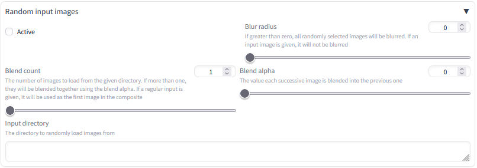
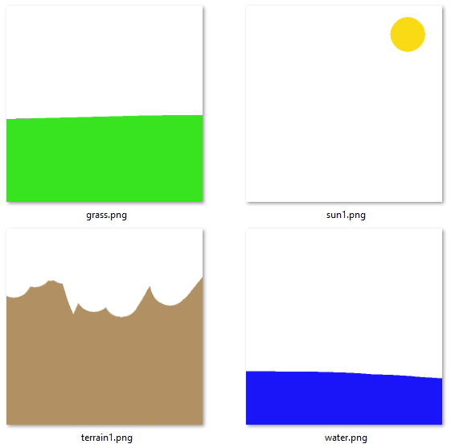
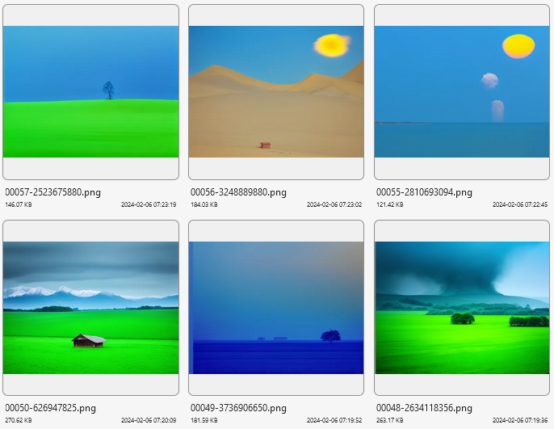

# Random img2img input extension for A1111's webui

An automatic1111 webui extension to load random images from a given folder as img2img inputs. It also enables compositing randomly loaded images over a given input image, and alpha compositing images randomly loaded over one another

## Installation

Go to the Extensions ▶ Install from URL tab in the webui, then paste `https://github.com/jmacc93/random_img2img_input` into the "URL for extension's git repository" box

Alternatively, in a terminal, `cd` to your `extensions` folder and use `git clone https://github.com/jmacc93/random_img2img_input`

Or, download the zip file from github (the green Code button ▶ Download ZIP), extract it, and put that in your `extensions` folder

## How to use

### With a blank regular input image

In the img2img tab, scroll down to `Random input images` and expand it. It looks like this:

Click the `Active` checkbox to make it active. Then copy the path of a directory containing at least one `.png` or `.jpg` image and paste it into the `Input directory` box

You should now be able to click generate. Even without a regular input image, the extension will load an image from the given folder and use that as the input image

### With a regular input image given

When you've given img2img an input image like normal, and the extension is active and has an input directory supplied, the extension will load a new random image from the directory and blend it over the regular input image

Make sure you change the `Blend alpha` slider to something other than 0! A small blend alpha means the random image will be fainly visible over the input image, and a high blend alpha means the random image will be strongly visible over the input image

### With multiple random images (a blend count > 1)

If you set the `Blend count` slider to something greater than 1, multiple images will be loaded randomly from the given input directory. They will be blended together in the same way that a single random image is blended onto a regular input image. This works most effectively when used with transparency and high `Blend alpha` values

### Using alpha compositing effectively

First, add a regular img2img input image as a background. Then set the `Blend alpha` to 1 or near 1, set the `Blend count` to something greater than 1, then enter a directory containing mostly-transparent input images with non-overlapping objects in them. This will pull the given number of images from the directory, and "paste" them over one another, with the transparent sections of new images not affecting the composite at all

As an example, here's a folder with some images with transparency

I put the `Blend count` to 2, `Blend alpha` to 1, then I set the prompt to "lanscape photograph", and I set the regular input image to a plain light blue image. To generate a bunch of images, I don't set the batch count (see limitations below) but instead right click the `Generate` button and click `Generate forever`. I let it run for awhile and then right click the `Generate` button again and click `Cancel generate forever` to stop generation. Heres the result:

As you can see, multiple random images were pulled from the given directory and overlayed one on top of another. The sun, for instance, is composited above the ground, no matter what the ground was because the ground and sun in the input images were non-overlapping.

### To see what the composite image looks like

To see the result of compositing without img2img changing the image, turn `Sampling steps` to 1 and turn the `Denoising strength` to 0 (and don't use DPM Adaptive or UniPC)

## Limitations

As far as I can tell, there is no way to easily modify every image in a batch of images. This is because there is apparently no script function call between when img2img multiplies the init image to the batch size, and when sampling ends. This means that this extension can't load different images for each image in a batch; the same image / image-blend is used for the entire batch
